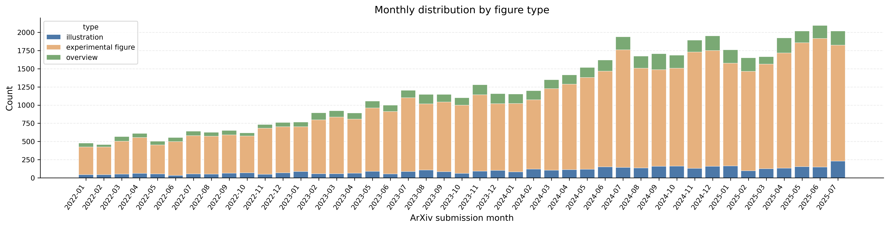
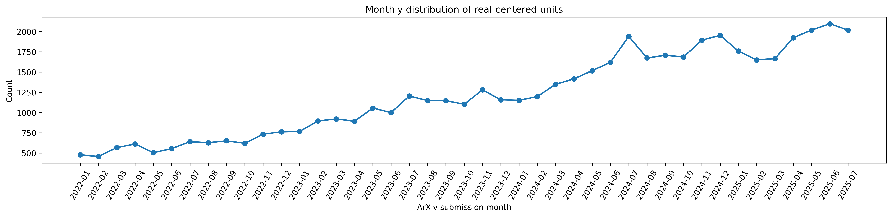

# SciFigDetect

SciFigDetect is a benchmark for AI-generated scientific figure detection. It pairs real scientific figures from licensed open-access papers with synthetic counterparts generated by Nano Banana Pro and GPT-image-1.5, and preserves prompts, figure-related paper context, and provenance metadata.

Project page: [https://joyce-yoyo.github.io/SciFigDetect/](https://joyce-yoyo.github.io/SciFigDetect/)


## News

> **Important:** The full SciFigDetect dataset is currently **under review and not publicly available yet**. It will be officially released after the paper is accepted.

## Data Access

The full SciFigDetect dataset will be released after the paper is accepted. The paper is currently under review, and the full dataset will be officially shared later.

After the dataset paper is accepted, if you would like to request access to the full dataset, please read and sign the data sharing agreement in:

- [`docs/Data sharing License Agreement.docx`](./docs/Data%20sharing%20License%20Agreement.docx)

### Access Process

1. Download and sign the data sharing agreement.
2. Email the signed agreement to [xiaobai.li@zju.edu.cn](mailto:xiaobai.li@zju.edu.cn) and [huyou@zju.edu.cn](mailto:huyou@zju.edu.cn).
3. Wait for confirmation and further instructions from the project team.

For access requests and questions, please contact [xiaobai.li@zju.edu.cn](mailto:xiaobai.li@zju.edu.cn) or [huyou@zju.edu.cn](mailto:huyou@zju.edu.cn).

## Highlights

- 72,965 real scientific figures
- 150,807 synthetic figures
- 50,379 aligned real-synthetic pairs
- 3 figure categories: Illustration, Overview, Experimental Figure
- 3 benchmark settings: zero-shot, cross-generator, degraded-image

## Dataset Source

All real figures in SciFigDetect are collected from figures in arXiv papers released under Creative Commons licenses. The source-paper collection window spans from **January 2022 to July 2025**.

This restriction helps keep the real subset traceable and license-compliant, while also making the collection period explicit. The figures cover three major categories in the benchmark: Illustration, Overview, and Experimental Figure.

### Monthly Distribution by Figure Type



This figure shows how the collected real figures are distributed over time for each figure category. It highlights the temporal coverage of the benchmark and the relative balance across figure types during the collection period.

### Monthly Total Distribution



This figure summarizes the total number of collected real figures by month. Together with the figure-type breakdown above, it provides a clearer view of the dataset source timeline from early 2022 to mid-2025.

## Dataset Composition

| Subset | Illustration | Overview | Experimental Figure | Total |
| --- | ---: | ---: | ---: | ---: |
| Real | 5,773 | 8,882 | 58,310 | 72,965 |
| Nano Banana | 4,616 | 6,608 | 39,155 | 50,379 |
| GPT | 9,090 | 13,164 | 78,174 | 100,428 |

## Example Subset in This Repository

This repository also includes a small example subset under `SciFigDetectDataset/` so users can quickly inspect the folder layout and data organization without downloading the full benchmark. To match the stated source range, the example figures are restricted to samples from papers uploaded before August 2025.

- `real/`: 21 real figures
- `banana/`: 38 Nano Banana figures
- `gpt/variant_1/`: 37 GPT figures
- `gpt/variant_2/`: 27 GPT figures

### Folder Structure

```text
SciFigDetectDataset/
├── real/
│   ├── experiment figure/
│   ├── illustration/
│   └── overview/
├── banana/
│   ├── experiment figure/
│   ├── illustration/
│   └── overview/
├── gpt/
│   ├── variant_1/
│   │   ├── experimental figure/
│   │   ├── illustration/
│   │   └── overview/
│   └── variant_2/
│       ├── experimental figure/
│       ├── illustration/
│       └── overview/
```

### Notes

- The image folders are organized by source and figure category.
- `real/` stores authentic figures from source papers.
- `banana/` stores synthetic figures generated by Nano Banana.
- `gpt/variant_1/` and `gpt/variant_2/` store synthetic figures generated by GPT with two variants.

## Sample Gallery

The examples below show aligned samples from the repository subset. Each row compares a real scientific figure with its Nano Banana and GPT counterparts.

### Illustration Example

| Real | Nano Banana | GPT |
| --- | --- | --- |
|  |  |  |

Source files:
`real/illustration/2504.02160_fig2.png` · `banana/illustration/2504.02160_fig2.png` · `gpt/variant_1/illustration/2504.02160_fig2.png`

### Overview Example

| Real | Nano Banana | GPT |
| --- | --- | --- |
|  |  |  |

Source files:
`real/overview/2406.04086_fig1.png` · `banana/overview/2406.04086_fig1.png` · `gpt/variant_1/overview/2406.04086_fig1.png`

### Experimental Figure Example

| Real | Nano Banana | GPT |
| --- | --- | --- |
|  |  |  |

Source files:
`real/experiment figure/2308.14409_fig4.png` · `banana/experiment figure/2308.14409_fig4.png` · `gpt/variant_1/experimental figure/2308.14409_fig4.png`

## What Each Sample Contains

Each benchmark sample is organized around:

- figure-related paper context
- one real figure
- one accepted synthetic figure
- auxiliary metadata

The metadata can include figure category, prompt, generator identity, license information, and review history.

## Construction Pipeline

SciFigDetect is built with an agent-based pipeline:

1. Retrieve licensed source papers.
2. Segment papers and extract figure-related text context.
3. Analyze figure layout and category.
4. Build structured prompts from multimodal signals.
5. Generate candidates with Nano Banana Pro or GPT-image-1.5.
6. Filter candidates through a review-driven refinement loop.
7. Store accepted samples with context and provenance.

## Benchmark Settings

- Zero-shot evaluation on off-the-shelf AIGI detectors
- Cross-generator transfer between Nano Banana and GPT
- Robustness evaluation under compression, blur, and noise

## Website

The repository root contains a GitHub Pages landing page:

- `index.html`
- `styles.css`
- `script.js`
- `assets/tease.jpg`

## Citation

```bibtex
@misc{hu2026scifigdetectbenchmarkaigeneratedscientific,
      title={SciFigDetect: A Benchmark for AI-Generated Scientific Figure Detection}, 
      author={You Hu and Chenzhuo Zhao and Changfa Mo and Haotian Liu and Xiaobai Li},
      year={2026},
      eprint={2604.08211},
      archivePrefix={arXiv},
      primaryClass={cs.CV},
      url={https://arxiv.org/abs/2604.08211}, 
}
```
