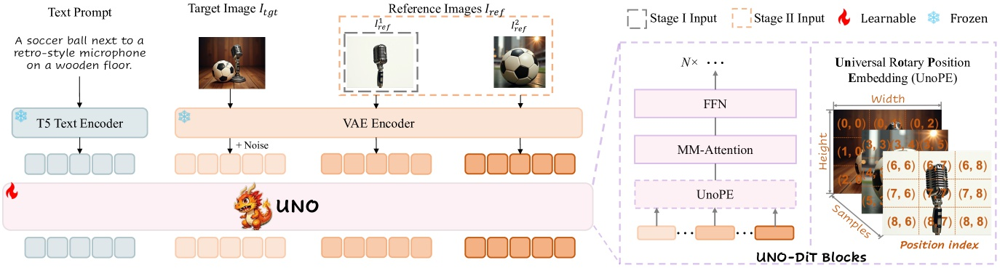
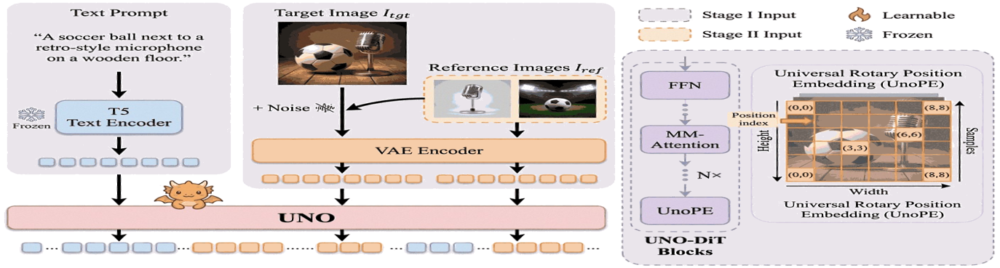
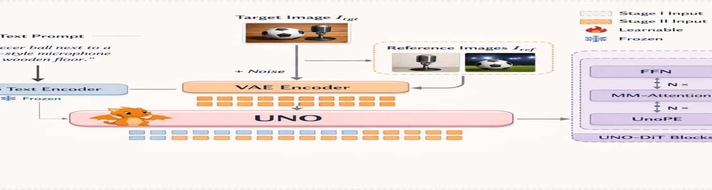
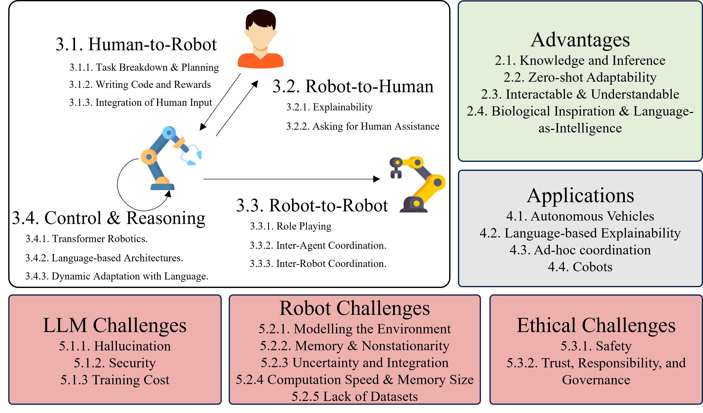
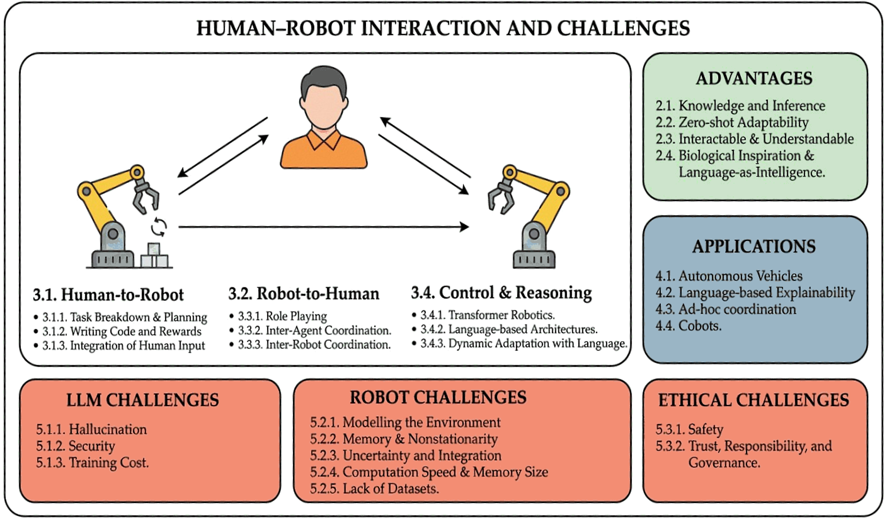
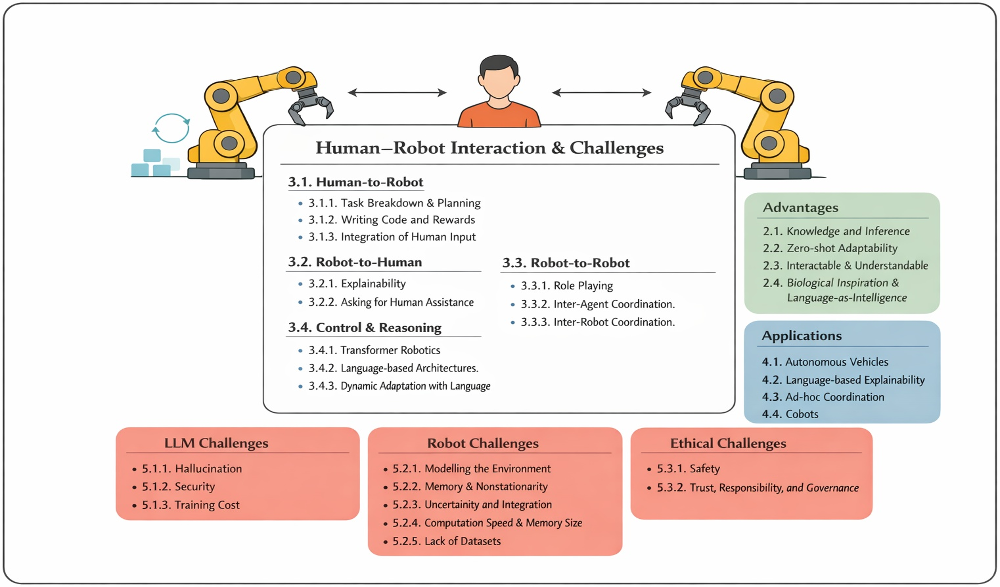

# SciFigDetect

SciFigDetect is a benchmark for AI-generated scientific figure detection. It pairs real scientific figures from licensed open-access papers with synthetic counterparts generated by Nano Banana Pro and GPT-image-1.5, and preserves prompts, figure-related paper context, and provenance metadata.

Project page: [https://joyce-yoyo.github.io/SciFigDetect/](https://joyce-yoyo.github.io/SciFigDetect/)


## Highlights

- 72,965 real scientific figures
- 150,807 synthetic figures
- 50,379 aligned real-synthetic pairs
- 3 figure categories: Illustration, Overview, Experimental Figure
- 3 benchmark settings: zero-shot, cross-generator, degraded-image

## Dataset Composition

| Subset | Illustration | Overview | Experimental Figure | Total |
| --- | ---: | ---: | ---: | ---: |
| Real | 5,773 | 8,882 | 58,310 | 72,965 |
| Nano Banana | 4,616 | 6,608 | 39,155 | 50,379 |
| GPT | 9,090 | 13,164 | 78,174 | 100,428 |

## Example Subset in This Repository

This repository also includes a small example subset under `SciFigDetectDataset/` so users can quickly inspect the folder layout and data organization without downloading the full benchmark.

- `real/`: 25 real figures
- `banana/`: 43 Nano Banana figures
- `gpt/variant_1/`: 42 GPT figures
- `gpt/variant_2/`: 32 GPT figures
- `splits_both/`: `train.json`, `val.json`, and `test.json` split files

### Folder Structure

```text
SciFigDetectDataset/
├── real/
│   ├── experiment figure/
│   ├── illustration/
│   └── overview/
├── banana/
│   ├── experiment figure/
│   ├── illustration/
│   └── overview/
├── gpt/
│   ├── variant_1/
│   │   ├── experimental figure/
│   │   ├── illustration/
│   │   └── overview/
│   └── variant_2/
│       ├── experimental figure/
│       ├── illustration/
│       └── overview/
└── splits_both/
    ├── train.json
    ├── val.json
    └── test.json
```

### Notes

- The image folders are organized by source and figure category.
- `real/` stores authentic figures from source papers.
- `banana/` stores synthetic figures generated by Nano Banana.
- `gpt/variant_1/` and `gpt/variant_2/` store synthetic figures generated by GPT with two variants.
- The split JSON files are lists of relative image paths, for example `illustration/1907.08735_fig5.jpg`, and can be used to reconstruct training, validation, and test subsets.

## Sample Gallery

The examples below show aligned samples from the repository subset. Each row compares a real scientific figure with its Nano Banana and GPT counterparts.

### Illustration Example

| Real | Nano Banana | GPT |
| --- | --- | --- |
|  |  |  |

Source files:
`real/illustration/2504.02160_fig2.png` · `banana/illustration/2504.02160_fig2.png` · `gpt/variant_1/illustration/2504.02160_fig2.png`

### Overview Example

| Real | Nano Banana | GPT |
| --- | --- | --- |
|  |  |  |

Source files:
`real/overview/2406.04086_fig1.png` · `banana/overview/2406.04086_fig1.png` · `gpt/variant_1/overview/2406.04086_fig1.png`

### Experimental Figure Example

| Real | Nano Banana | GPT |
| --- | --- | --- |
|  |  |  |

Source files:
`real/experiment figure/2308.14409_fig4.png` · `banana/experiment figure/2308.14409_fig4.png` · `gpt/variant_1/experimental figure/2308.14409_fig4.png`

## What Each Sample Contains

Each benchmark sample is organized around:

- figure-related paper context
- one real figure
- one accepted synthetic figure
- auxiliary metadata

The metadata can include figure category, prompt, generator identity, license information, and review history.

## Construction Pipeline

SciFigDetect is built with an agent-based pipeline:

1. Retrieve licensed source papers.
2. Segment papers and extract figure-related text context.
3. Analyze figure layout and category.
4. Build structured prompts from multimodal signals.
5. Generate candidates with Nano Banana Pro or GPT-image-1.5.
6. Filter candidates through a review-driven refinement loop.
7. Store accepted samples with context and provenance.

## Benchmark Settings

- Zero-shot evaluation on off-the-shelf AIGI detectors
- Cross-generator transfer between Nano Banana and GPT
- Robustness evaluation under compression, blur, and noise

## Website

The repository root contains a GitHub Pages landing page:

- `index.html`
- `styles.css`
- `script.js`
- `assets/tease.jpg`

## Citation

```bibtex
@article{scifigdetect2026,
  title={SciFigDetect: A Benchmark for AI-Generated Scientific Figure Detection},
  author={Anonymous Author(s)},
  year={2026}
}
```
